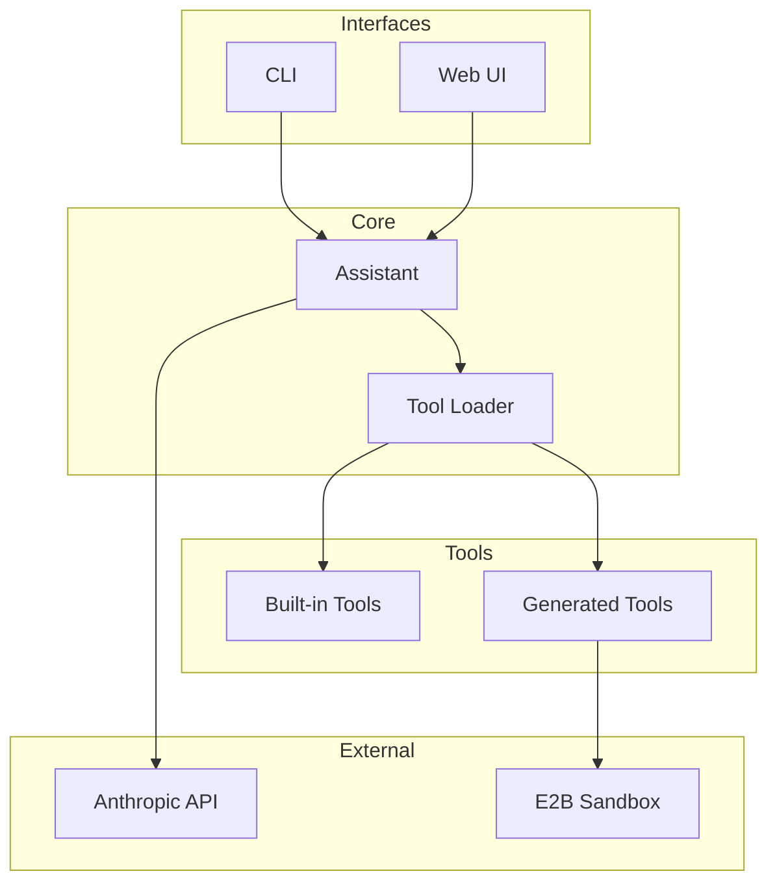

# Architecture Diagram

```mermaid
flowchart TD
    subgraph Interfaces
        A[CLI] 
        B[Web UI]
    end
    subgraph Core
        C[Assistant]
        D[Tool Loader]
    end
    subgraph Tools
        E[Built-in Tools]
        F[Generated Tools]
    end
    subgraph External
        G[Anthropic API]
        H[E2B Sandbox]
    end
    A --> C
    B --> C
    C --> D
    D --> E
    D --> F
    C --> G
    F --> H
```
