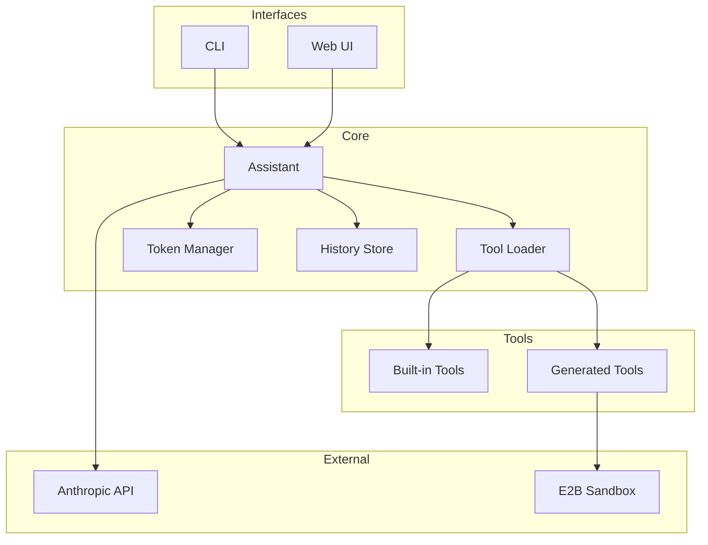

# Architecture Diagram

```mermaid
flowchart TD
    subgraph Interfaces
        A[CLI] 
        B[Web UI]
    end
    subgraph Core
        C[Assistant]
        D[Tool Loader]
        E[Token Manager]
        F[History Store]
    end
    subgraph Tools
        G[Built-in Tools]
        H[Generated Tools]
    end
    subgraph External
        I[Anthropic API]
        J[E2B Sandbox]
    end
    A --> C
    B --> C
    C --> D
    C --> E
    C --> F
    D --> G
    D --> H
    C --> I
    H --> J
```
